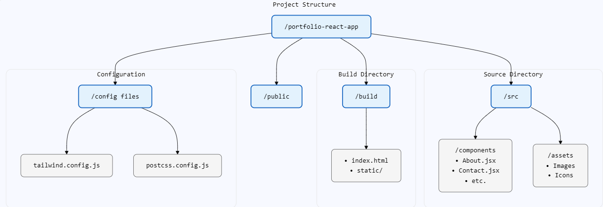

# Personal Portfolio Website

This is a personal portfolio website built using React and Tailwind CSS. It is deployed on GitHub Pages using GitHub Actions.

## Getting Started

To get started with this project, first clone the repository and navigate to the project directory.

- `git clone` https://github.com/musthaq96/portfolio-react-app.git
- `cd portfolio-react-app`
- Next, install the dependencies by running `yarn install`.

## Available Scripts

In the project directory, you can run:

### `yarn start`

Runs the app in the development mode.\
Open [http://localhost:3000](http://localhost:3000) to view it in your browser.

The page will reload when you make changes.\
You may also see any lint errors in the console.

### `yarn build`

Builds the app for production to the `build` folder.\
It correctly bundles React in production mode and optimizes the build for the best performance.

The build is minified and the filenames include the hashes.\
Your app is ready to be deployed!

### Deployment to GitHub Pages

To deploy the app to GitHub Pages, run `yarn run deploy`.

## Setting up GitHub Actions for Deployment, an example

To set up GitHub Actions for deployment, follow these steps:

1. In your repository on GitHub, navigate to the "Actions" tab.
2. Click on "New workflow" and select "set up a workflow yourself".
3. Replace the content of the file with the following:

```
name: Deploy to GitHub Pages

on: push: branches: - main

jobs: build-and-deploy: runs-on: ubuntu-latest steps: - name: Checkout uses: actions/checkout@v2

- name: Set up Node.js
  uses: actions/setup-node@v2
  with:
  node-version: 16.x

- name: Install dependencies
  run: yarn install

- name: Build
  run: yarn build

- name: Deploy
  uses: peaceiris/actions-gh-pages@v3
  with:
  github_token: ${{ secrets.GITHUB_TOKEN }}
  publish_dir: ./build

```

4. Commit and push your changes.

Now, every time you push changes to the `main` branch, your app will be automatically built and deployed to GitHub Pages.





code2prompt --exclude="node_modules/**,.venv/**,__pycache__/**,public/**,*.svg,*.ico,package-lock.json,yarn.lock" .

backend % PYTHONPATH=$(pwd) pytest tests

create .documents folder to store data
.chroma_db will be the location


Browser Policy Compliance - AutoPlay Music
Automatically handles all three browser policy scenarios:
Audio is allowed (plays immediately)
User has interacted with the site (plays after interaction)
Site has been allowlisted (plays immediately)


Future To do:
1. Vite + React
Faster development experience
Better TypeScript support
More modern build tools
Easier to maintain and scale


have this in the root folder,
# Default API base URL for development
REACT_APP_API_BASE_URL=http://localhost:8000

ollama pull phi3:mini
ollama pull tinyllama (this did not work)

# Make sure your .venv is activated
source .venv/bin/activate
python document_processor.py